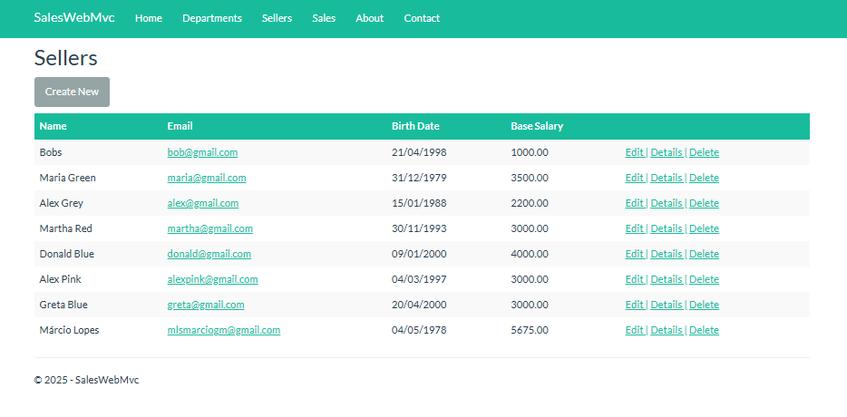
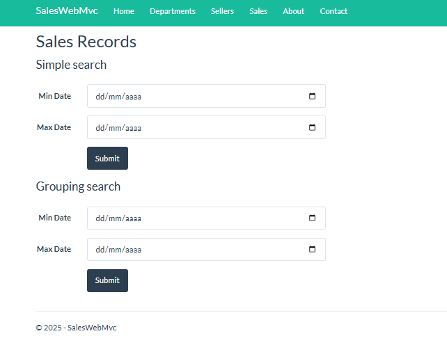
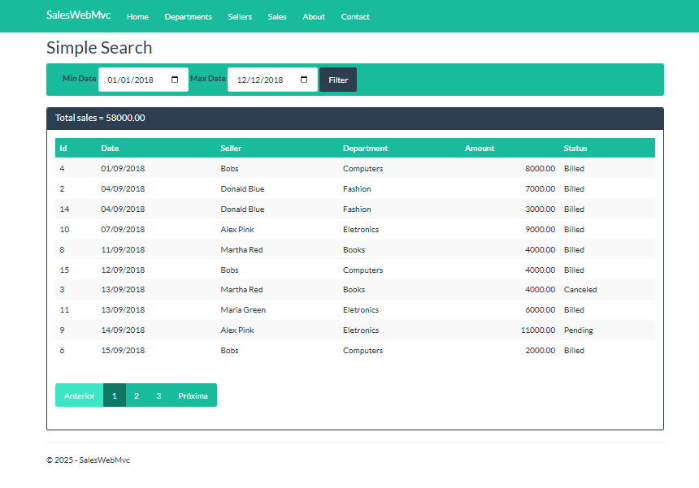
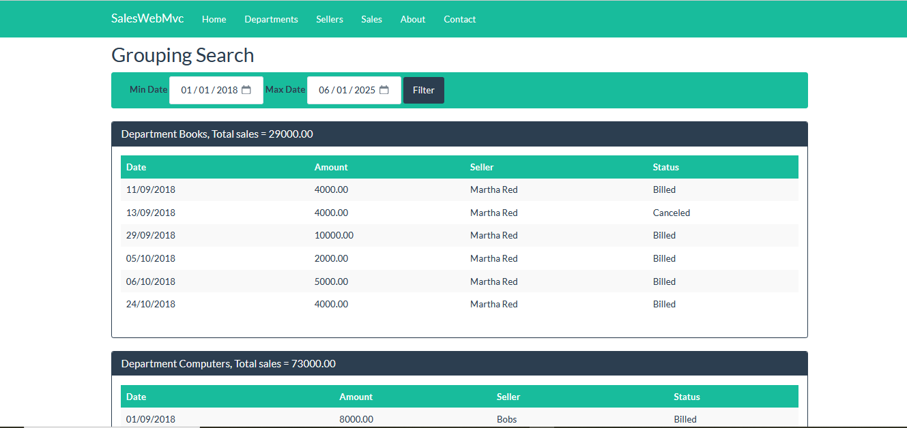

# Projeto ASP.NET Core MVC - Sistema de Vendas

Este é um projeto de introdução ao **ASP.NET Core MVC** utilizando a linguagem **C#** e o banco de dados **MySQL**, acessado por meio do **Entity Framework Core**.

---

## Tecnologias Utilizadas

- **.NET Core 2.1**
- **Visual Studio Community 2019**
- **C#**
- **Entity Framework Core**
- **MySQL**

---

## Descrição do Projeto

O sistema simula uma aplicação de cadastro e controle de vendedores vinculados a departamentos, com registro e consulta de vendas.

### Funcionalidades:

- **CRUD completo de Vendedores**
  - Listagem com opções para:
    - Adicionar novo registro
    - Editar
    - Ver detalhes
    - Deletar

- **Consulta de Vendas**
  - Busca **simples**
    - Paginação simples (paginação tradicional)
    
  - Busca **agrupada por departamento**
    - Paginação por demanda (scroll dinâmico)
    
  - *Estes recursos de paginação foram adicionados ao conteúdo dado no curso.*

---

## Estrutura Relacional

- Cada **vendedor** pertence a um **departamento**.
- Cada **venda** está relacionada a um **vendedor**.

---

## Imagens do Projeto

### Tela de Listagem de Vendedores


### Tela de Busca de Vendas


### Tela de Listagem de Vendas - Com paginação


### Tela de Listagem Agrupada por Departamento - Com paginação por demanda


---

## Como Executar

1. Clone o repositório:
   ```bash
   git clone https://github.com/mlsmarcio/workshop-asp-net-core-mvc.git

Abra o projeto no Visual Studio 2019.

Configure a string de conexão com o MySQL no appsettings.json.

Aplique as migrations do Entity Framework:
```bash
Update-Database
